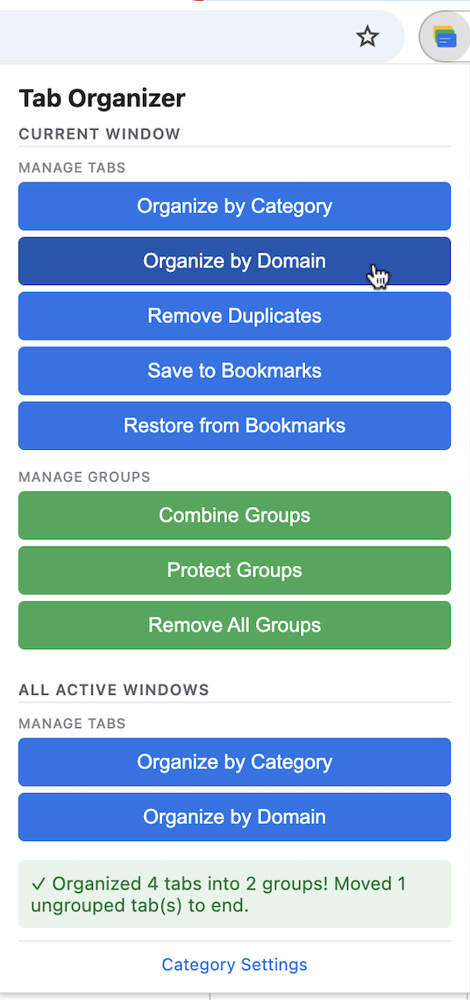
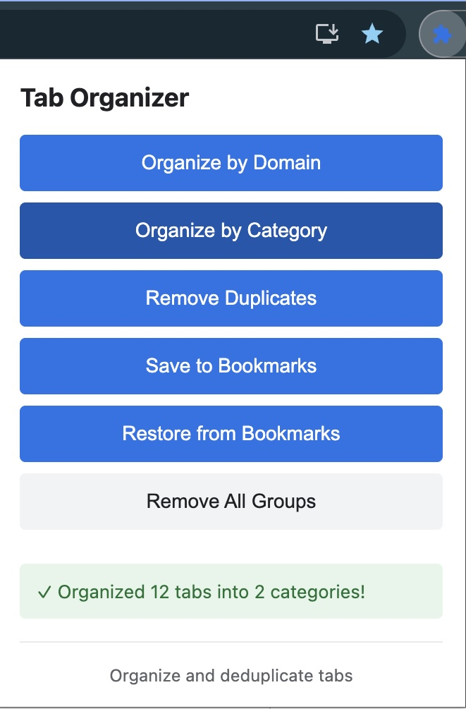
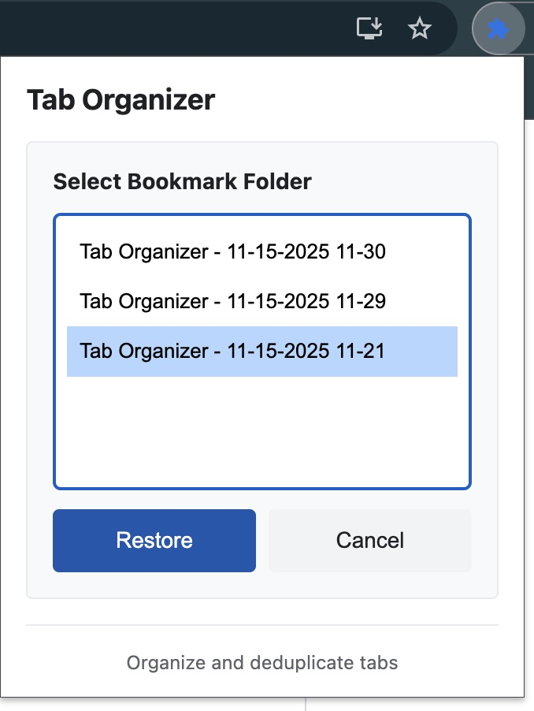

# Chrome Tab Manager 🗂️

[](https://github.com/malston/chrome-tabs/actions/workflows/ci.yml)
[](https://github.com/malston/chrome-tabs/actions/workflows/ci.yml)

> Chrome extension for managing tabs: organize by domain, remove duplicates, and save to bookmarks.

**Quick Links:** [Features](#features) • [Installation](#quick-start) • [Usage](#usage) • [Screenshots](#screenshots) • [Releases](#releases) • [Contributing](#contributing) • [Project Board](https://github.com/users/malston/projects/2)

---

## Screenshots

### Extension Popup

The extension provides a clean, simple interface with one-click actions:


### Organized Tabs by Domain

Tabs automatically grouped by domain with color coding:



### Organized Tabs by Category

Tabs intelligently categorized by their purpose:



### Bookmark Restore Interface

Select and restore previously saved tab sessions:



## Features

### 🎯 Chrome Extension

- **One-click organization** - Automatically group tabs by domain or category
- **One-click deduplication** - Remove duplicate tabs instantly
- **Save to bookmarks** - Save all tabs into bookmark folders by group
- **Restore from bookmarks** - Restore tab groups from saved bookmarks
- **Smart coloring** - Each group gets a unique color
- **Shows tab counts** - See how many tabs in each group
- **Works everywhere** - Use in any Chrome profile, anytime
- **No setup required** - No remote debugging, no command line

## Quick Start

### Install the Chrome Extension (Recommended)

#### Option 1: Install from Release (Easiest)

1. **Download the latest release**:
   - Go to [Releases](https://github.com/malston/chrome-tabs/releases)
   - Download `chrome-tab-manager-vX.X.X.zip` (or beta version)
   - Unzip the downloaded file

2. **Load in Chrome**:
   - Open Chrome and navigate to: `chrome://extensions/`
   - Enable "Developer mode" (toggle in top-right)
   - Click "Load unpacked"
   - Select the unzipped folder
   - Pin the extension to your toolbar

#### Option 2: Install from Source

```bash
# Clone the repository
git clone https://github.com/malston/chrome-tabs.git
cd chrome-tabs

# Open Chrome and navigate to:
chrome://extensions/

# Enable "Developer mode" (toggle in top-right)
# Click "Load unpacked"
# Select: chrome-tabs/chrome-extension
```

See [chrome-extension/README.md](chrome-extension/README.md) for detailed instructions.

## Usage

### Organize Tabs by Domain

**Use the Chrome Extension**:

1. Click the Tab Organizer icon in your toolbar
2. Click "Organize by Domain"
3. Done! All tabs grouped automatically

Example result:

- `github.com (25)` - All GitHub tabs
- `acme.com (24)` - All acme.com tabs
- `local-network (7)` - All lab IPs

### Organize Tabs by Category

**Use the Chrome Extension**:

1. Click the Tab Organizer icon in your toolbar
2. Click "Organize by Category"
3. Done! All tabs grouped by category

Example result:

- `Development (32)` - GitHub, Stack Overflow, localhost tabs
- `Documentation (18)` - All docs sites
- `Social Media (12)` - Twitter, LinkedIn, Reddit tabs
- `Shopping (8)` - Amazon, eBay tabs

### Remove Duplicate Tabs

**Use the Chrome Extension**:

1. Click the Tab Organizer icon
2. Click "Remove Duplicates"
3. Done! All duplicate URLs removed

### Save Tabs to Bookmarks

**Use the Chrome Extension**:

1. Organize your tabs first (by Domain or Category)
2. Click the Tab Organizer icon
3. Click "Save to Bookmarks"
4. Done! All tabs saved as bookmarks in organized folders

All bookmarks are saved in "Other Bookmarks" under a timestamped folder. Each tab group becomes its own bookmark folder.

### Restore Tabs from Bookmarks

**Use the Chrome Extension**:

1. Click the Tab Organizer icon
2. Click "Restore from Bookmarks"
3. Select a previously saved bookmark folder
4. Click "Restore"
5. Done! Tabs and groups are recreated

**Smart Features:**

- Merges tabs into existing groups with the same name
- Automatically skips duplicate URLs
- Creates new groups for groups that don't exist yet

**Use Your Own Bookmark Folders:**

You can restore from any bookmark folder by following this naming convention:

1. Place your folder in "Other Bookmarks"
2. Name it starting with "Tab Organizer -" (e.g., "Tab Organizer - My Project")
3. Organize bookmarks into subfolders (subfolder names become tab group names)
4. The extension will detect and list your folder for restoration

## Requirements

- Chrome browser

## Project Structure

```sh
chrome-tabs/
├── chrome-extension/       # Chrome Extension
│   ├── manifest.json
│   ├── src/
│   │   ├── background/     # Service worker and feature modules
│   │   ├── popup/          # Extension UI
│   │   └── utils/          # Shared utilities
│   └── README.md
├── Makefile                # Development commands
└── README.md               # This file
```

## How It Works

- Uses Chrome's native Tab Groups API for organization
- Uses Chrome's Tabs API for deduplication
- Groups tabs by extracting domain from URLs
- Removes duplicates by tracking seen URLs
- Assigns colors and counts automatically
- **No remote debugging needed!**

## Troubleshooting

### Extension not working?

- Make sure Developer Mode is enabled on `chrome://extensions/`
- Reload the extension (click the refresh icon)
- Check the service worker console for errors

## Tips

- **Daily use**: The Chrome Extension is instant and works everywhere
- **Session restore**: Chrome's built-in session restore (Cmd+Shift+T) recovers closed tabs
- **Pin the extension**: Pin it to your toolbar for easy access

## Workflow Examples

### Spring Cleaning

1. Click extension → "Remove Duplicates"
2. Click extension → "Organize by Domain" or "Organize by Category"
3. Manually close groups you don't need
4. Done!

### Before Closing Chrome

1. Click extension → "Organize by Domain"
2. Review your tab groups
3. Click extension → "Save to Bookmarks" for important groups
4. Close Chrome with confidence

## Releases

### For Users

**Latest Release:** [v0.9.0 Beta](https://github.com/malston/chrome-tabs/releases/latest)

All releases include:
- Ready-to-install extension zip file
- Complete release notes
- Installation instructions
- Changelog

**Installing from a Release:**
1. Visit the [Releases page](https://github.com/malston/chrome-tabs/releases)
2. Download the `.zip` file from the latest release
3. Follow the installation instructions above

### For Developers

**Creating a New Release:**

Releases are automated via GitHub Actions. To create a new release:

1. **Update version** in `chrome-extension/manifest.json`:
   ```json
   "version": "1.1.0"
   ```

2. **Commit and push**:
   ```bash
   git add chrome-extension/manifest.json
   git commit -m "Release v1.1.0"
   git push origin main
   ```

3. **Create and push tag**:
   ```bash
   git tag v1.1.0
   git push origin v1.1.0
   ```

4. **Wait for workflow** to complete:
   - GitHub Actions automatically creates a draft release
   - Extension zip is created and uploaded
   - Release notes are generated

5. **Publish the release**:
   - Go to [Releases](https://github.com/malston/chrome-tabs/releases)
   - Review the draft release
   - Click "Publish release"

**Beta Releases:**
- Use version format like `0.9.0` for pre-1.0 releases
- Tag as `v0.9.0-beta`
- Workflow marks as pre-release automatically

See [.github/workflows/README.md](.github/workflows/README.md) for complete workflow documentation.

## Contributing

We welcome contributions from the community! Whether you want to report a bug, request a feature, or submit code improvements, here's how to get involved:

### 📋 Project Board

Track current development, planned features, and ongoing work on our [GitHub Project Board](https://github.com/users/malston/projects/2).

### 🐛 Report a Bug

Found a bug? Please [open an issue](https://github.com/malston/chrome-tabs/issues/new) with:
- Clear description of the problem
- Steps to reproduce
- Expected vs actual behavior
- Chrome version and OS

### 💡 Request a Feature

Have an idea? We'd love to hear it!
- Check the [Project Board](https://github.com/users/malston/projects/2) to see if it's already planned
- [Open a feature request](https://github.com/malston/chrome-tabs/issues/new) describing:
  - The problem you're trying to solve
  - Your proposed solution
  - Any alternatives you've considered

### 🔧 Submit a Pull Request

Ready to contribute code? Great!

1. **Read the guidelines**: Check out [CONTRIBUTING.md](CONTRIBUTING.md) for detailed instructions
2. **Fork and clone** the repository
3. **Create a branch**: `git checkout -b feature/your-feature-name`
4. **Make your changes** following our coding standards
5. **Test thoroughly** - both manual testing and linting
6. **Submit a PR** with a clear description of your changes

### 📚 Documentation

Improvements to documentation are always welcome! This includes:
- README updates
- Code comments
- Examples and screenshots
- Contributing guidelines

### 🙏 Thank You

All contributions are appreciated, whether it's code, documentation, bug reports, or feature ideas!

## License

MIT License - feel free to modify and use as needed.
