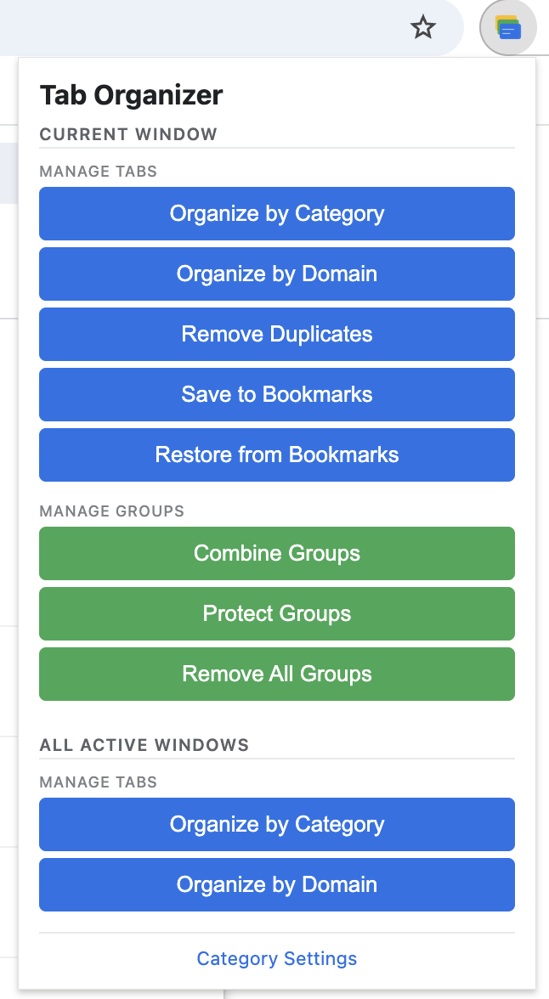

# Chrome Tab Manager

Complete solution for managing Chrome tabs: organize by domain, remove duplicates, and recover from history.


## Screenshots

### Extension Popup

The extension provides a clean, simple interface with one-click actions:

<!-- TODO: Add screenshot of popup interface showing all buttons -->
```sh
┌─────────────────────────┐
│   Tab Organizer         │
├─────────────────────────┤
│ [Organize by Domain]    │
│ [Organize by Category]  │
│ [Remove Duplicates]     │
│ [Save to Bookmarks]     │
│ [Restore from Bookmarks]│
│ [Remove All Groups]     │
└─────────────────────────┘
```

### Organized Tabs by Domain

Tabs automatically grouped by domain with color coding:

<!-- TODO: Add screenshot showing tabs organized by domain -->
```sh
Tab Groups:
🔵 github.com (25)
🔴 acme.com (24)
🟡 local-network (7)
```

### Organized Tabs by Category

Tabs intelligently categorized by their purpose:

<!-- TODO: Add screenshot showing tabs organized by category -->
```sh
Tab Groups:
🔵 Development (32)
🔴 Documentation (18)
🟡 Social Media (12)
🟢 Shopping (8)
```

### Bookmark Restore Interface

Select and restore previously saved tab sessions:

<!-- TODO: Add screenshot showing bookmark folder selector -->
```sh
┌──────────────────────────────┐
│ Select Bookmark Folder       │
├──────────────────────────────┤
│ ▼ Tab Organizer - 01-15 14:30│
│   Tab Organizer - 01-14 10:15│
│   Tab Organizer - 01-13 09:00│
├──────────────────────────────┤
│  [Restore]  [Cancel]         │
└──────────────────────────────┘
```

## Features

### 🎯 Chrome Extension (Primary Tool)

- **One-click organization** - Automatically group tabs by domain or category
- **One-click deduplication** - Remove duplicate tabs instantly
- **Save to bookmarks** - Save all tabs into bookmark folders by group
- **Restore from bookmarks** - Restore tab groups from saved bookmarks
- **Smart coloring** - Each group gets a unique color
- **Shows tab counts** - See how many tabs in each group
- **Works everywhere** - Use in any Chrome profile, anytime
- **No setup required** - No remote debugging, no command line

### 🔧 Command-Line Tools (Optional)

- **History Recovery** - Restore tabs from your browsing history

## Quick Start

### Install the Chrome Extension (Recommended)

```bash
# Open Chrome and navigate to:
chrome://extensions/

# Enable "Developer mode" (toggle in top-right)
# Click "Load unpacked"
# Select: /path/to/chrome-tabs/chrome-extension
```

See [chrome-extension/README.md](chrome-extension/README.md) for detailed instructions.

### Install Command-Line Tools (Optional)

```bash
make install
```

## Usage

### Organize Tabs by Domain

**Use the Chrome Extension**:

1. Click the Tab Organizer icon in your toolbar
2. Click "Organize by Domain"
3. Done! All tabs grouped automatically

Example result:

- `github.com (25)` - All GitHub tabs
- `acme.com (24)` - All acme.com tabs
- `local-network (7)` - All lab IPs

### Organize Tabs by Category

**Use the Chrome Extension**:

1. Click the Tab Organizer icon in your toolbar
2. Click "Organize by Category"
3. Done! All tabs grouped by category

Example result:

- `Development (32)` - GitHub, Stack Overflow, localhost tabs
- `Documentation (18)` - All docs sites
- `Social Media (12)` - Twitter, LinkedIn, Reddit tabs
- `Shopping (8)` - Amazon, eBay tabs

### Remove Duplicate Tabs

**Use the Chrome Extension**:

1. Click the Tab Organizer icon
2. Click "Remove Duplicates"
3. Done! All duplicate URLs removed

### Save Tabs to Bookmarks

**Use the Chrome Extension**:

1. Organize your tabs first (by Domain or Category)
2. Click the Tab Organizer icon
3. Click "Save to Bookmarks"
4. Done! All tabs saved as bookmarks in organized folders

All bookmarks are saved in "Other Bookmarks" under a timestamped folder. Each tab group becomes its own bookmark folder.

### Restore Tabs from Bookmarks

**Use the Chrome Extension**:

1. Click the Tab Organizer icon
2. Click "Restore from Bookmarks"
3. Select a previously saved bookmark folder
4. Click "Restore"
5. Done! Tabs and groups are recreated

**Smart Features:**

- Merges tabs into existing groups with the same name
- Automatically skips duplicate URLs
- Creates new groups for groups that don't exist yet

**Use Your Own Bookmark Folders:**

You can restore from any bookmark folder by following this naming convention:

1. Place your folder in "Other Bookmarks"
2. Name it starting with "Tab Organizer -" (e.g., "Tab Organizer - My Project")
3. Organize bookmarks into subfolders (subfolder names become tab group names)
4. The extension will detect and list your folder for restoration

### Recover Lost Tabs from History

**Use the command-line tool**:

```bash
# Restore from last 7 days of history
make restore-history

# Or with custom options
uv run restore_from_history.py --days 30 --limit 500
```

Note: Requires Chrome to be running with remote debugging. See troubleshooting below.

## Requirements

- **Chrome Extension**: Just Chrome browser
- **Command-Line Tools** (optional, for history recovery):
  - Python 3.8+
  - [uv](https://github.com/astral-sh/uv) package manager

## Available Commands

```bash
make help            # Show all available commands
make install         # Install dependencies
make restore-history # Restore tabs from history
make clean           # Clean up
```

## Project Structure

```sh
chrome-tabs/
├── chrome-extension/       # Chrome Extension (main tool!)
│   ├── manifest.json
│   ├── background.js       # Tab grouping & dedupe logic
│   ├── popup.html/js       # Extension UI (3 buttons)
│   └── README.md
├── restore_from_history.py # History recovery script
├── Makefile                # Easy command access
└── README.md               # This file
```

## How It Works

### Chrome Extension

- Uses Chrome's native Tab Groups API for organization
- Uses Chrome's Tabs API for deduplication
- Groups tabs by extracting domain from URLs
- Removes duplicates by tracking seen URLs
- Assigns colors and counts automatically
- **No remote debugging needed!**

### History Recovery

- Reads Chrome's History SQLite database
- Filters by date range and limit
- Creates new tabs via DevTools Protocol
- Useful for recovering accidentally closed tabs
- Requires Chrome with `--remote-debugging-port`

## Troubleshooting

### Extension not working?

- Make sure Developer Mode is enabled on `chrome://extensions/`
- Reload the extension (click the refresh icon)
- Check the service worker console for errors

### Can't restore history?

- History recovery requires Chrome with remote debugging
- Make sure Chrome history isn't cleared
- Try increasing `--days` or `--limit` parameters
- Check: `~/Library/Application Support/Google/Chrome/Default/History`

### How to enable remote debugging for history recovery

```bash
# Close all Chrome windows, then:
/Applications/Google\ Chrome.app/Contents/MacOS/Google\ Chrome \
  --remote-debugging-port=9222 \
  --user-data-dir=/tmp/chrome-debug-profile &
```

## Tips

- **Daily use**: Just use the Chrome Extension - it's instant and works everywhere
- **Tab recovery**: Use `make restore-history` if you accidentally closed important tabs
- **Session restore**: Chrome's built-in session restore (Cmd+Shift+T) also works great
- **Pin the extension**: Pin it to your toolbar for easy access

## Workflow Examples

### Spring Cleaning

1. Click extension → "Remove Duplicates"
2. Click extension → "Organize by Domain" or "Organize by Category"
3. Manually close groups you don't need
4. Done!

### Recover Lost Tabs

1. Run `make restore-history`
2. Review and close unwanted tabs
3. Click extension → "Organize by Domain"

### Before Closing Chrome

1. Click extension → "Organize by Domain"
2. Review your tab groups
3. Bookmark important groups
4. Close Chrome with confidence

## Contributing Screenshots

To add actual screenshots to this README:

1. **Take screenshots** of the extension in action:
   - Extension popup showing all buttons
   - Tabs organized by domain with visible tab groups
   - Tabs organized by category
   - Bookmark restore interface with folder selection
   - Success status messages

2. **Save screenshots** to the `screenshots/` directory:
   - `screenshots/popup.png` - Extension popup interface
   - `screenshots/organize-domain.png` - Tabs grouped by domain
   - `screenshots/organize-category.png` - Tabs grouped by category
   - `screenshots/bookmark-restore.png` - Bookmark folder selector
   - `screenshots/success-message.png` - Example success message

3. **Update README** by replacing the TODO comments with actual image links:

   ```markdown
   
   ```

## License

MIT License - feel free to modify and use as needed.
